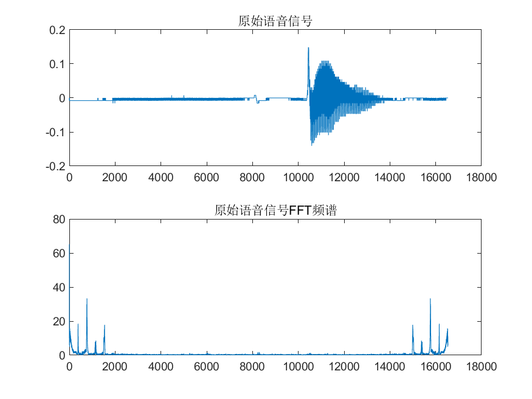
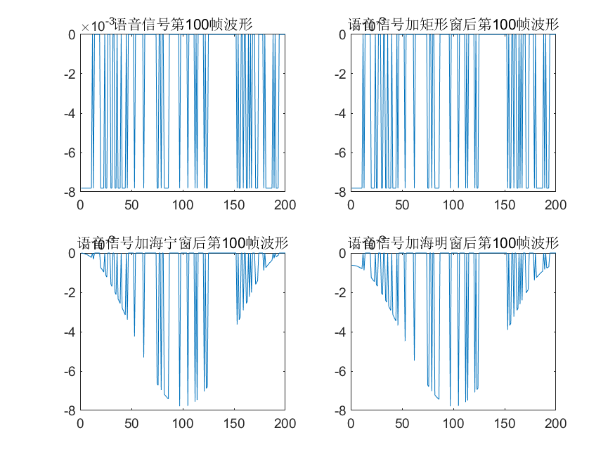
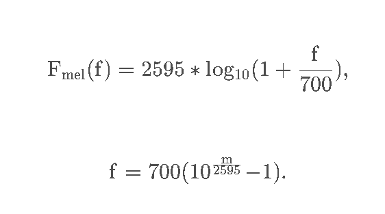
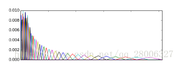
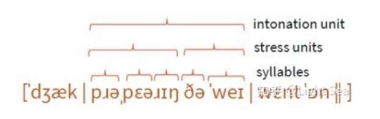

 # 
 学习历程
## 9/14

- 分帧：语音分帧的长度取10~40ms左右；帧与帧之间有重叠，相邻两帧的起始位置的时间差叫做帧移，帧移一般为帧长的1/2，3/4。

- 加窗：频谱泄露一般是由信号被非周期截断产生的，引入窗函数；好的窗函数设计应该满足频谱的能量主要集中在主瓣，尽量使旁瓣的能量低，使得窗口内的信号近似具有周期性。

- DFT（离散傅里叶变换）：  

- 
先将语音信号分成小段再加窗（加窗信号为更低频）平滑掉分帧信号的两端从而减少频谱泄露。
相关文章链接：[https://zhuanlan.zhihu.com/p/397643730](https://zhuanlan.zhihu.com/p/397643730 "分帧，加窗和DFT")。  

## 9/15
### 一、用MATLAB实现对语音信号的分帧和加窗

- 在MATLAB中添加Voice-box语音处理工具箱，相关链接：[https://zhuanlan.zhihu.com/p/441538313](https://zhuanlan.zhihu.com/p/441538313 "Matlab语音处理工具箱Voice-box安装")；voicebox函数中文说明，相关链接：[https://juejin.cn/post/6979873557878833189](https://juejin.cn/post/6979873557878833189 "【基础教程】基于matlab工具voicebox函数中文说明【含Matlab源码 032期】")；  
相关介绍如下： 

    readwav   - 读取WAV文件
    writewav  - 写WAV文件
    readhtk   - 读 HTK waveform文件
    writehtk  - 写 HTK waveform 文件
    readsfs   - 读 SFS文件
    readsph   - 读 SPHERE/TIMIT waveform 文件
    readaif   - 读 AIFF Audio Interchange file format 文件
    readcnx   - 读 BT Connex database 文件
    readau    - 读 AU文件(from SUN)
    readflac  -读 FLAC 文件

- 第一个语音处理的代码学习，相关链接：[https://blog.csdn.net/qq_44420246/article/details/103226100](https://blog.csdn.net/qq_44420246/article/details/103226100 "Matlab对语音信号做fft及对语音信号进行分帧加窗")；
代码如下：  

    clc;
    clear;
    close all;
    [x1,fs]=audioread('C:\Users\forest\Desktop\Wave\b1.wav');  %读取音频文件lantian.wav
    info=audioinfo('C:\Users\forest\Desktop\Wave\b1.wav') 
    figure()
    plot(boxcar(200))   %画矩形窗波形
    title('矩形窗');
    figure()
    plot(hanning(200))  %画海宁窗波形
    title('海宁窗');
    figure()
    plot(hamming(200))  %画海明窗波形
    title('海明窗');
    y1=fft(x1,256);     %对语音信号进行256点fft变换
    figure()
    subplot(211);
    plot(x1);
    title('原始语音信号');
    subplot(212);
    plot(abs(y1(1:256)));
    title('原始语音信号FFT频谱');
    x2=enframe(x1,200,100);%分帧
    figure();%画图
    subplot(221);
    plot(x2(50,:))   %画第50帧波形
    title('语音信号第50帧波形');
    x3=enframe(x1,boxcar(200),100); %每两百个点分为一帧，再加矩形窗
    subplot(222);
    plot(x3(50,:))   %画第50帧波形
    title('语音信号加矩形窗后第50帧波形');
    x4=enframe(x1,hanning(200),100);%每两百个点分为一帧，再加加海宁窗
    subplot(223);
    plot(x4(50,:))   %画第50帧波形
    title('语音信号加海宁窗后第50帧波形');
    x5=enframe(x1,hamming(200),100);%每两百个点分为一帧，再加海明窗
    subplot(224);
    plot(x5(50,:))   %画第50帧波形
    title('语音信号加海明窗后第50帧波形');
&emsp;&emsp;三个窗函数：矩形窗，海宁窗，海明窗：boxcar(),hanning(),hamming(),c窗函数的输入参数为语音信号时域点数。
&emsp;&emsp;快速傅里叶变换FFT：可以指定变换的点数（256，1024等等），也可以将采样的点数全部进行FFT，则每一个时域采样点对应一个频率点。一般讨论的信号长度指的是信号的采样点数，处理语音的离散时域信号时很多函数的输入参数都是信号长度Length。
&emsp;&emsp;下图为语音信号时域图和频域图：

&emsp;&emsp;下图为语音信号时域第100帧波形：

##9/16
###一、Mel滤波器组
&emsp;&emsp;相关链接：[https://blog.csdn.net/chumingqian/article/details/124950613](https://blog.csdn.net/chumingqian/article/details/124950613 "音频（六）Mel滤波器组_原理简介")。
- 简介 梅尔刻度：
> 1.为什么需要 Mel 刻度：
> MEL刻度模拟人耳对不同频率语音的感知：
> 研究表明，人类对频率的感知并不是线性的，并且对低频信号的感知要比高频信号敏感。对1kHz以下，与频率成线性关系，对1kHz以上，与频率成对数关系。频率越高，感知能力就越差。
> 例如，人们可以比较容易地发现500和1000Hz的区别，但很难发现7500和8000Hz的区别。
> 
> 2.Mel（melody）刻度定义：
> 这时，梅尔标度(the Mel Scale)被提出，它是Hz的非线性变换，对于以mel scale为单位的信号，可以做到人们对于相同频率差别的信号的感知能力几乎相同。m被称作Mel频率。

&emsp;&emsp;如下图所示，40个三角滤波器组成滤波器组，低频处滤波器密集，门限值大，高频处滤波器稀疏，门限值低。恰好对应了频率越高人耳越迟钝这一客观规律。下图所示的滤波器形式叫做等面积梅尔滤波器（Mel-filter bank with same bank area），在人声领域（语音识别，说话人辨认）等领域应用广泛，但是如果用到非人声领域，就会丢掉很多高频信息。

###二、语谱图
&emsp;&emsp;相关链接：
###三、MFCC特征提取
&emsp;&emsp;相关链接：[https://zhuanlan.zhihu.com/p/181718235](https://zhuanlan.zhihu.com/p/181718235 "AI大语音（四）| MFCC特征提取（深度解析）")
##9/17  
###一、语音合成基础(1)——语音和TTS
&emsp;&emsp;相关链接：[https://zhuanlan.zhihu.com/p/99122527](https://zhuanlan.zhihu.com/p/99122527 "语音合成基础(1)——语音和TTS")
- 发声：清音，简单来说，发清音时声带不振动，因此清音没有周期性。浊音，发音时声带振动的音称为浊音。辅音有清有浊，而多数语言中的元音均为浊音，鼻音、边音、半元音也是浊音。
- 语音的频率：基础频率F0，浊音中存在基础频率，而清音中不存在，F0决定了声音的音高。formants共振峰，是一种元音特有的在频域中的现象，因为只有元音有基础频率。每个元音都有两个共振峰，可以用来区分元音，记为F1和F2。F1,F2取决于基础频率，如果基础频率太高，共振峰可能会消失，这种情况下就区分不出来元音。timbre音色，音色在广义上是指声音不同于其它的特点，在语音中不同的音节都有不同的特点，这可以通过频域观察出来。
- 音节组成：逆向则是基于HMM的语音识别模型，从句子到短语单词最后到音素，

- TTS Pipeline（Text-To-Speech，语音合成，特指从文字合成出语音）：从文字到语音，是我们语音识别的逆过程，比较复杂，不太相关。
###二、语音合成基础(2)——听觉系统和ASR
&emsp;&emsp;相关链接：[https://zhuanlan.zhihu.com/p/99590311](https://zhuanlan.zhihu.com/p/99590311 "语音合成基础(2)——听觉系统和ASR")
- 前半部分介绍听觉系统，耳朵如何转化声音。
###三、语音合成基础(3)——关于梅尔频谱你想知道的都在这里
&emsp;&emsp;相关链接：[https://zhuanlan.zhihu.com/p/421460202](https://zhuanlan.zhihu.com/p/421460202 "语音合成基础(3)——关于梅尔频谱你想知道的都在这里")

