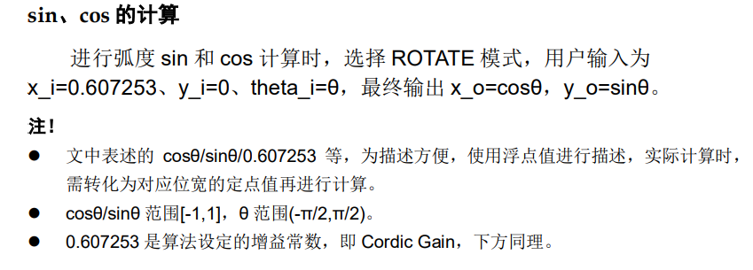

# DSP and Mathematics
## 一、CORDIC
主要特征：  
- 可实现sin/cos、arctan、坐标旋转、极坐标与直角坐标转换功能；  
- 可选iterate（迭代）、pipeline（流水线）、conbinatorial（组合）实现方式；  
- 可选择弧度、角度模式。  
### 基本计算及模式说明
&emsp;&emsp;输入、输出数据以定点方式（补码）进行计算，

### 端口描述
- 当选择 ITERATE 模式时，端口存在；当 init=1
时，加载输入值；
- x_i,y_i,x_o,y_o 位宽一致，由配置参数“XY Bits”值决定；  
- theta_i,theta_o 位宽一致，由配置参数“Theta Bits”值决定。
### 时序说明
- PIPELINE 模式每个时钟周期都有输入，在 16（Iterations）个时钟周期
后每个时钟周期都有输出。
- COMBINATORIAl 模式是组合逻辑进行迭代，在单个时钟周期产生输入
输出。
- ITERATE 模式一个时钟周期输入后，延时 16（Iterations）个时钟周期输
出但是必须在输出之后才能继续进行输入（尽量不适用）。
### 调用及配置
- Iteration Accuracy：设定迭代次数，范围 16~32；
- Cordic Gain：只读，cordic 算法的增益常数。
## 二、Complex Multiplier
用于实现复数的乘法。  
主要特征：
- 支持输入数据位宽变化；
- 支持有符号数和无符号数计算；
- 支持同步复位和异步复位；
- 支持输出延时。
### 功能描述
- 当GUI配置输入的数据位宽N<=9时，输出数据位宽为19位；当9<N<=18时，输出数据位宽为37位；当18<N<=26时，输出数据位宽为73 位；
-  寄存器参数配置可通过启用DSP中的寄存器实现延时输出。输出的延时周期最多可延时3个周期，最少不进行延时（手动添加寄存器增加延时）。
## 三、FFT
主要特征
- 支持正向快速傅里叶变换和反向快速傅里叶变换
- 变换的点数支持8-16384点
- 数据位宽可选8bits-36bits
- 旋转因子位宽可选8bits-36bits
- 乘法器类型可选
- 存储器类型可选
### 静态配置
1. #### 数据缩小方法：
FFT IP 支持每个基 2 阶后右移 1bit、端口动态决定以及不进行移位的几种方案，低资源结构还支持数据块浮点模式。
2. #### 数据宽度：
- 当不进行数据缩小时，还可选择内部小数位宽，小数位宽支持0-6bits；
- 变换器支持任意设定输入位宽和小数位宽，只要二者之和落在在8-36bits之内即可；
- 输出位宽由系统自动决定，通常输出位宽不小于输入位宽和小数位宽之和。
3. #### 尾数处理方法：
FFT IP支持两种尾数处理方法，一种是截断法，另一种是取整法。截断法更节约芯片资源，取整法得到的结果将更精确。 
### 握手协议（时序要求）
1. #### 启动输入数据：
一切就绪后，可以通过将**start**置为高电平，来启动一次FFT变换。数个周期后，**sod**变为高电平，持续一个周期，同时**ipd**将变为高电平，并在整个数据输入阶段始终保持高电平，指示正在输入数据，另外**idx**输出当前时钟采样的序列标号。当一次数据输入结束以后**eod**变为高电平，持续一个周期，同时**ipd**变为低电平。至此，一次数据输入完成。
2. #### FFT计算数据：
数据输入完成后数个周期将自动开始FFT计算过程，同时**busy**将变为高电平，表示内核正在进行FFT数据的计算，计算完成后busy将变为低电平。
3. #### 输出数据卸载：
当FFT计算完成后数个周期，自动进入数据卸载阶段，**soud** 将在第一个卸载数据周期变为高电平，并持续一个周期，**opd**也将变为高电平，并在整个卸载数据的过程中保持高电平。在数据卸载的最后一个周期**eoud**将变为高电平，并持续一个周期，**opd**也将在下一个周期变为低电平。
### 信号定义

### 接口时序

（第二个我没看懂）
## Fixed Point Divider
主要特征：
- 可实现定点有符号小数的除法运算；
- 可配置数据位宽（input data width）；
- 可配置小数位精度（decimal precision）；
- 输出延迟周期与参数的配置有关（数据位宽和小数位精度）。
### 数据的解读
输入与输出数据（被除数、除数、商）使用定点原码进行计算，负数也采用原码计算。output data width为输出数据位宽，大小与input data width**相同**且随之变化。decimal precision为小数位精度，范围是1到input data width-2。
### 信号时序

在start和complete信号同为高电平时，输入dividend（被除数）和divisor（除数）并开始运行。
## 